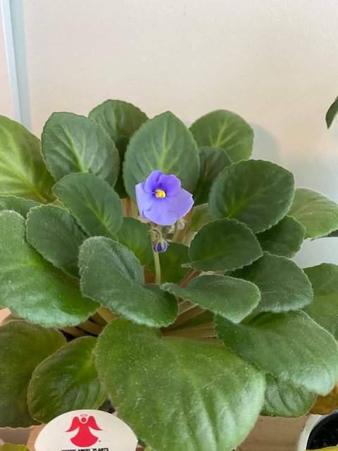

I'm trying to figure out how to manage images; I don't really want to do [page bundles](https://gohugo.io/content-management/page-bundles/)...but I guess I am for now. Meh.

Annnnd, of course, I can't get any of the theme's built-in image shortcodes to actually _respect_ my settings--do I want my images linked? No, no I do not. And why the FUCK is it not rendering the CSS that at least hides my link formatting? I have it in the right order, it's just straight-up _ignoring_ me. I'm starting to think I need to find another, simpler theme to work with. This one is awfully finicky and NOT GOOD at respecting my choices. Which is why I wanted to get away from the WordPress ecosystem in the first place: to have better choices.

Anyhow. Enjoy this image of my African violet blooming--I've never had one bloom before, and I've even managed to keep it alive for over a year. That's a victory, for sure. The second image is of my current knitting project, [Mutual Admiration Society](https://www.ravelry.com/patterns/library/mutual-admiration-society) (Rav link, sorry), which I bought as a kit eons ago. It uses a technique new to me, mosaic knitting, which is slipping stitches on every row with two alternating colors. It looks a lot harder than it actually is. The gray speckled yarn is Miss Babs's Yowza and it is incredible to work with--I would love to make a sweater with this stuff, it's so round and bouncy and nice to work with.

