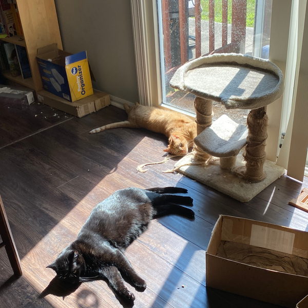

In an attempt to clean out my bookmarks/saved links on Pocket, I share with you a short list of things I found interesting, amusing, or thought-provoking. I'll leave it as an exercise for the reader which is which.

- [The Real Reason Woodpeckers Don’t Get Concussions](<https://www.theatlantic.com/science/archive/2022/07/woodpeckers-brain-injury-protection-evolutionary-adaptation/670516/>)
- [A Frog So Small, It Could Not Frog](https://www.theatlantic.com/science/archive/2022/06/pumpkin-toadlet-frogs-uncontrolled-landing-jumps/661262/)
- [The Evolution of Anti-Critical Consumption/Thinking “Anti-Anti” Fandom](https://stitchmediamix.com/2021/12/01/the-evolution-of-anti-critical-consumption-thinking-anti-anti-fandom/)
- [Community Over Commodity](http://distributedweb.care/posts/community/)
- [Some Other Words That Trans People Should Destroy, Now That You Can't Say "Woman"](https://buttondown.email/charliejane/archive/some-other-words-that-trans-people-should-destroy/)
- [Compound pejoratives on Reddit – from 'buttface' to 'wankpuffin'](https://colinmorris.github.io/blog/compound-curse-words)

It's been incredibly hot here. So hot that the cats have melted:

